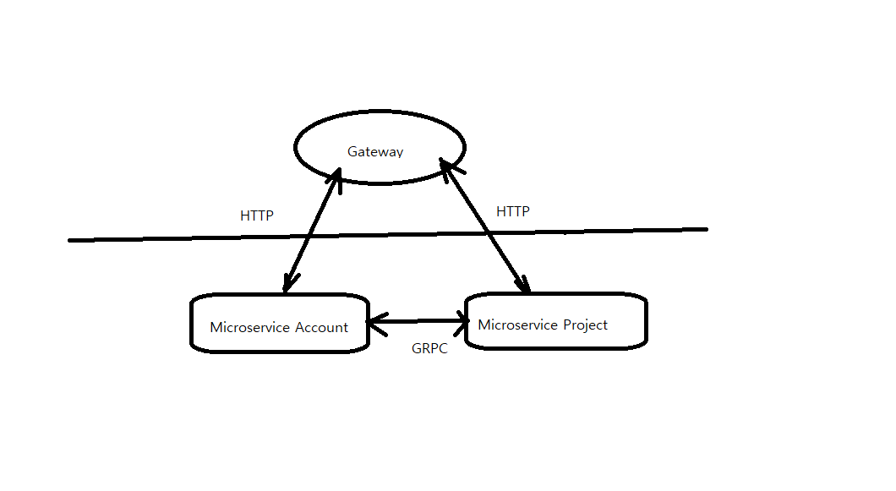

## Description

- Simple example managing projects for users using NestJS/Protocol Buffer/gRPC/MongoDB/Prisma.
- 2 microservices & gateway to communicate with microservices.
- Microservices communicates via gRPC protocol
- Added swagger.
- Added prisma log
- Added microservice leveraging RabbitMQ
- Added JWT token

  
## Stay in touch

